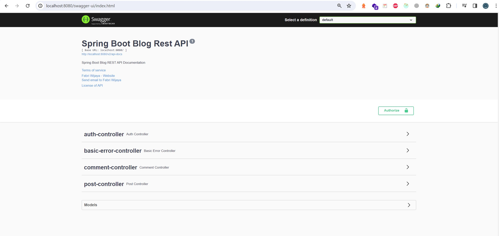
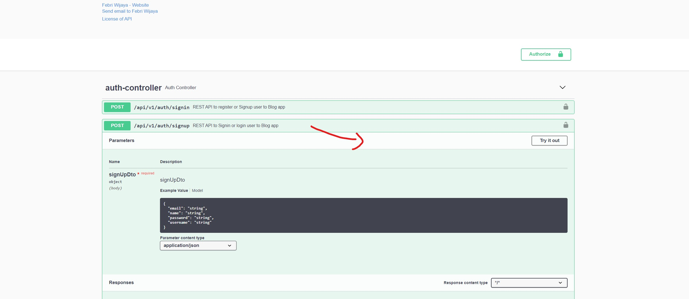
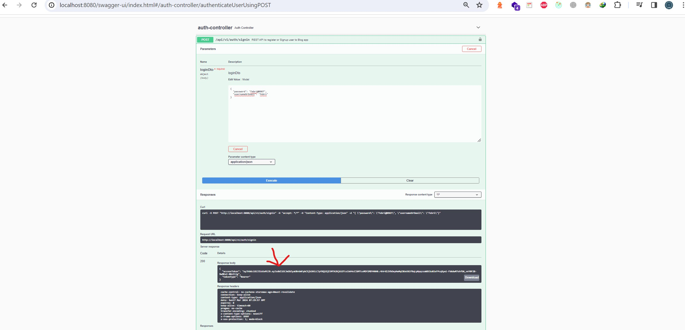
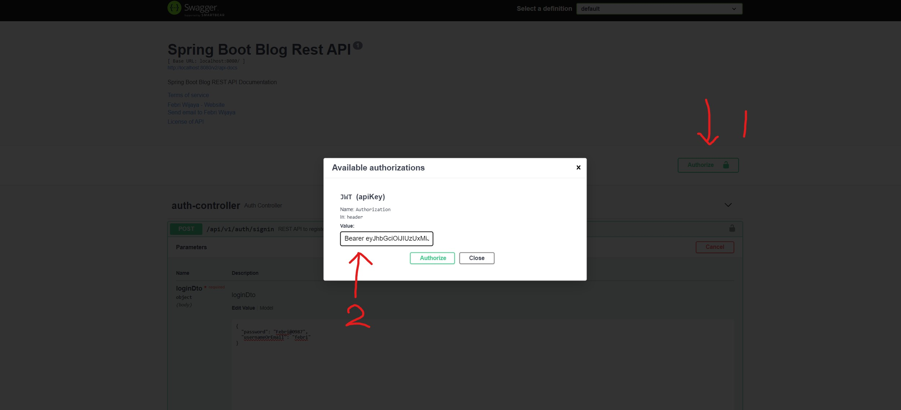
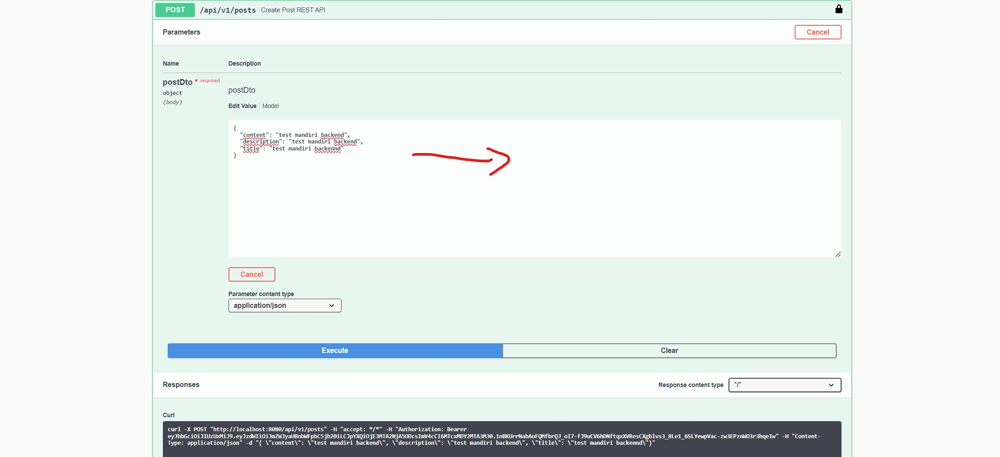
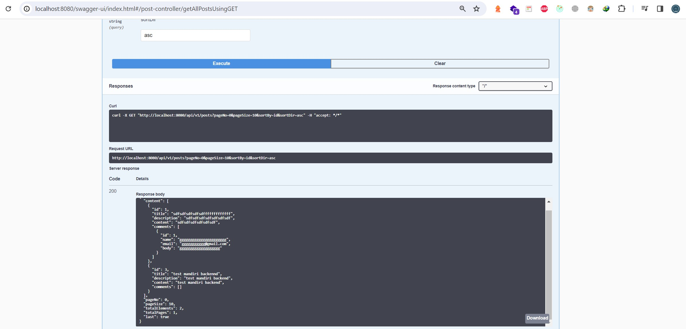

<!DOCTYPE html>
<html lang="en">
<head>
    <meta charset="UTF-8">
    <meta name="viewport" content="width=device-width, initial-scale=1.0">
    <title>Petunjuk Penggunaan</title>
</head>
<body>
    <h1>Spring Boot Rest Api - Blog Application</h1>
    <h2>Teknologi yang digunakan :</h2>
    <ul>
        <li>Springboot</li>
        <li>Mysql</li>
        <li>Jdk 17</li>
    </ul>
    <h2>Fitur fitur pada aplikasi :</h2>
    <ul>
        <li>CRUD Operations dengan tabel post dan comments</li>
        <li>Sign up dan sign</li>
        <li>JWT Token</li>
        <li>Spring IoC</li> 
        <li>Java Stream</li>
        <li>Intermediate Native SQL Query with spring data JPA (lebih baik dan lebih aman)</li>
        <li>Containerization & Microservices with docker</li>
    </ul>
    <h2>Petunjuk penggunaan :</h2>
    <ul>
        <li>Pastikan Docker dan Docker Compose Terinstal di laptop anda</li>
        <li>Unduh file projects Spring boot</li>
        <li>Buka projects di text editor seperti intellij</li>
        <li>Buka terminal dan posisikan ke project spring boot dan ketikkan perintah : <b>mvn clean package</b>, jika perintah ini error,
            maka jalankan perintah : <b><i>mvn clean install -DskipTests</i></b></li>
        <li>Jalankan Aplikasi di terminal menggunakan perintah : <b>docker-compose up --build</b> </li>
        <li>Jika berhasil, anda bisa membukanya di browser dengan mengetikkan url : http://localhost:8080/swagger-ui/index.html</li>
        
        <li>untuk memulai menggunakan api, anda harus mendaftar terlebih dahulu, jika tidak mendaftar maka endpoint yang lain tidak bisa digunakan karena belum di authorize, </li>
        
        <li>Setelah berhasil signup, sekarang mulai sign in dan anda akan mendapatkan tokennya</li>
        
        <li>Kemudian Setelah token nya berhasil di dapatkan copy ke lambang gembok, agar bisa melakukan post, delete dan put , dengan cara isi : Bearer tokennya, contohnya :</li>
        
        <li>Untuk melakukan post data, silahkan sesuaikan responsenya menjadi seperti ini </li>
        
        <li>Jika berhasil bisa dilihat pada method get, seperti pada gambar dibawah ini :</li>
        
        <li>Jika ingin melakukan insert dan delete serta update endpoint lainnya, pada request json, hapus saja request idnya, id nya dimasukkan melalui kolom inputan</li>
    </ul>
</body>
</html>